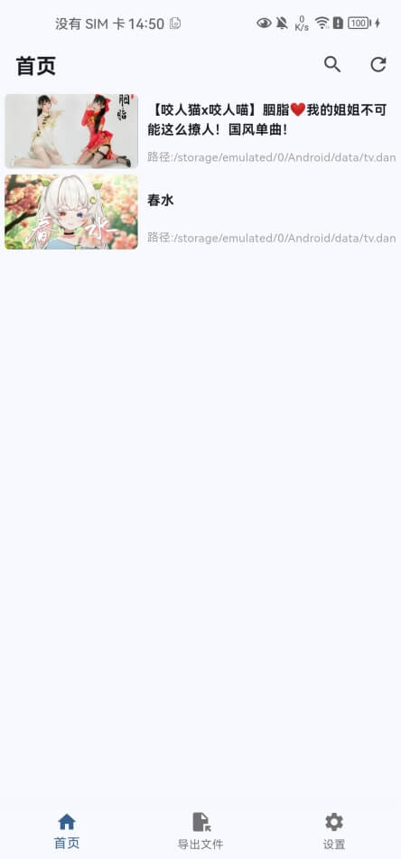
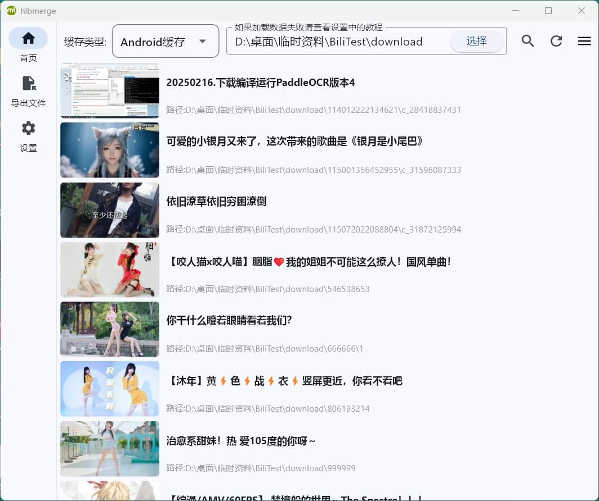
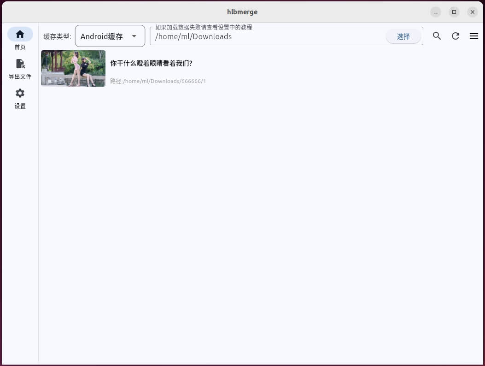
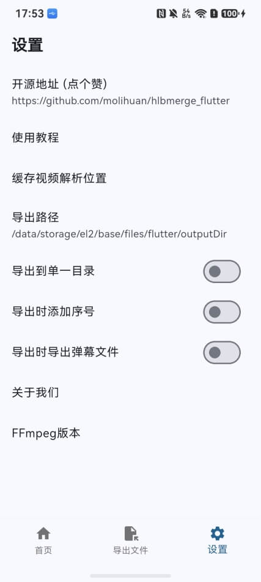
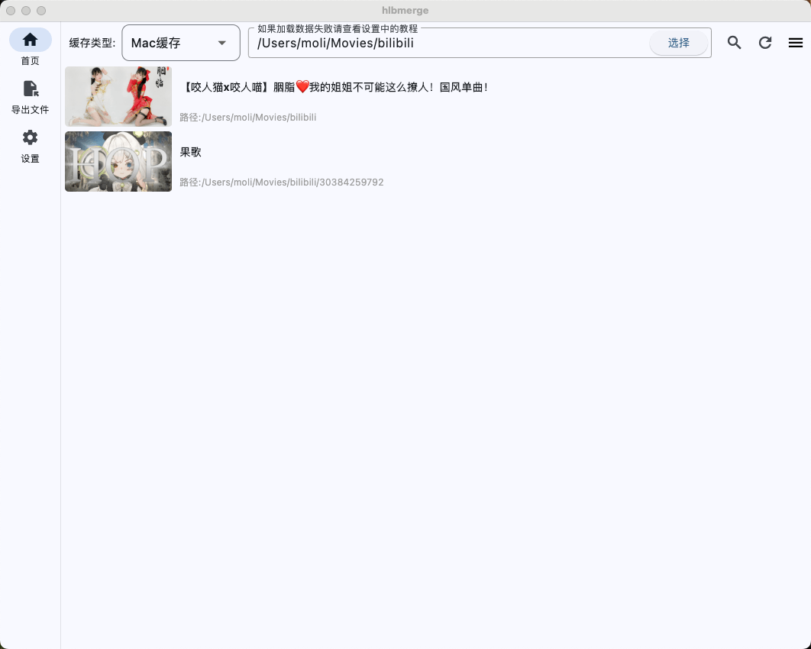
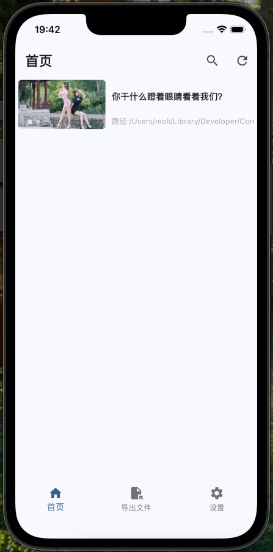

<p align="center">

</p>
<h1 align="center">HLB站缓存合并</h1>

[](https://github.com/molihuan/mlhfileselectorlib/blob/master/LICENSE)[](https://github.com/molihuan/hlbmerge_flutter)[](https://space.bilibili.com/454222981)[](https://blog.csdn.net/molihuan)

<h3 align="center">把Bilibili缓存视频导出为MP4格式</h3>
<p align="center">将Bilibili缓存视频合并导出为MP4，支持android、windows(10以上)、linux、mac、harmony(仅2in1和PC)、ios，支持B站Android客户端缓存，支持B站Windows客户端缓存，支持B站Mac客户端缓存</p>
<p align="center">Combine and export Bilibili cache files as MP4, support Android, Windows, Linux, Mac,Harmony,IOS, support Bilibili Android client cache, support Bilibili Windows client cache, support Bilibili Mac client cache</p>

## 说明

B站的"学习视频"经常失效/下架，此软件可以将缓存的"学习视频"导出为mp4，方便我们"学习"。将B站缓存视频合并导出为mp4格式，导出支持android、windows、linux、mac、harmony(仅2in1和PC)、ios，仅用于学习技术交流，严禁任何形式的商业用途，如有侵权请联系我删除，由此给你带来困惑和不便我深感抱歉。

## 特性

- [x] 合并(导出)B站缓存视频(或音频)
- [x] 支持B站Android客户端缓存(国内版、概念版、谷歌版、HD版)
- [x] 支持B站Windows客户端缓存
- [x] 支持B站Mac客户端缓存
- [x] 支持第三方B站客户端(bilimiao)
- [x] 不支持B站Harmony客户端缓存
- [x] 不支持B站IOS、iPad客户端缓存
- [x] 反人类设计
- [x] 卡 卡 卡!!!
- [x] 时常崩溃

## 前言

#### 在开始之前可以给项目一个Star吗？非常感谢，你的支持是我唯一的动力
#### 项目地址： [Github地址](https://github.com/molihuan/hlbmerge_flutter)     [Gitcode地址](https://gitcode.com/bigmolihuan/hlbmerge_flutter)

## 截图 (如果图片无法显示请前往国内镜像[Gitcode](https://gitcode.com/bigmolihuan/hlbmerge_flutter))

| 平台截图                                                                                                                            |
|---------------------------------------------------------------------------------------------------------------------------------|
| Android                                                                                                                         |
|  |
| Windows                                                                                                                         |
|  |
| Linux                                                                                                                           |
|      |
| ohos                                                                                                                            |
|  |
| Mac                                                                                                                             |
|          |
| ios                                                                                                                             |
|          |
| Web                                                                                                                             |
| 待补充                                                                                                                             |


# 注意 ! ! !

- 此软件存放的目录不能有空格或特殊字符
- 读取缓存视频的目录不能有空格或特殊字符
- 输出目录不能有空格或特殊字符
- 视频名称或标题不能有特殊字符(虽然做了兼容处理,但可能无法兼顾到所有的特殊字符)
- 它不依赖网络这个不确定的因素，它只依赖本地缓存文件，只要本地有缓存文件，那么它就可以工作(即使视频已经下架)，需要和官方APP（手机版/电脑版均可）配合使用，官方APP进行缓存，它操作缓存文件进行合并导出mp4

## 下载链接：[跳转](https://gitcode.com/bigmolihuan/hlbmerge_flutter/releases) 

> 为了照顾国内网友,现在releases安装包仅在国内镜像仓库上传,望理解。


## 使用教程：[跳转](https://github.com/molihuan/hlbmerge_flutter/blob/master/res/tutorial/README.md) 


## 问题反馈

##### 因为有你软件才更加完善

请使用模板反馈问题，这样可以帮助开发者快速定位和解决问题，谢谢配合，爱你萌萌哒~^o^~

##### 反馈模板:

设备信息：(必填)

描述,怎样触发bug：(必填，越详细越好)

视频链接：(必填，如果视频已经下架则把本地缓存文件打包压缩发我邮箱)


## 常用命令:
```sh
# 创建项目
# flutter create --org com.molihuan --platforms=android,ios,web,windows,macos,linux,ohos hlbmerge

# 创建插件
# flutter create --org com.molihuan --template=plugin_ffi --platforms=android,ios,windows,macos,linux,ohos ffmpeg_hl

# 更新子模块
git submodule update --remote ffmpeg_xmake

# windows打包
flutter build windows

# macOS打包
flutter build macos

# Linux打包
flutter build linux --debug

# 虚拟机ui倒置问题运行
LIBGL_ALWAYS_SOFTWARE=1 flutter run -d linux

# Android分割 ABI 构建，减小 apk 大小
flutter build apk --release --split-per-abi

# 鸿蒙打包
flutter build hap

# 生成图标
flutter pub run flutter_launcher_icons

```

## 源码编译事项
- flutter 3.35.7
- xmake 3.0.9

- 首先需要编译ffmpeg_core,编译脚本在[ffmpeg_xmake/src/xmake](ffmpeg_xmake/src/xmake), 编译时需要搭建好ffmpeg编译环境,否则无法编译
- 如果不想编译ffmpeg_core那么需要自行修改[ffmpeg_xmake/src/CMakeLists.txt](ffmpeg_xmake/src/CMakeLists.txt),处理好动态库链接和拷贝问题,ffmpeg_core动态库已编译上传到仓库的[ffmpeg_xmake/src/xmake/build](ffmpeg_xmake/src/xmake/build)

#### Linux编译特别注意
```shell
# 需要安装
sudo apt install libayatana-appindicator3-dev
```

## 特别鸣谢

- https://gitee.com/l2063610646/bilibili-convert
- https://www.bilibili.com/video/BV1gv4y1M7yn/
- https://github.com/sk3llo/ffmpeg_kit_flutter
- https://github.com/RikkaApps/Shizuku
- https://github.com/10miaomiao/bili-down-out
- https://zhuanlan.zhihu.com/p/704594199

教程或开源项目以及其依赖项目。

## 📄许可证 [LICENSE](LICENSE.txt)


